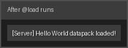
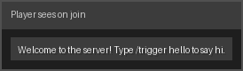
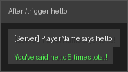

# Tutorial: Hello World — Your First Datapack

**Difficulty:** Beginner  
**Time:** ~20 minutes  
**Prerequisites:** [Getting Started](../guide/getting-started)

## What You'll Build

A minimal datapack that greets every player when they join, tracks how many times you say "hello" with a scoreboard, and displays a welcome title screen.

By the end you'll understand:

- Namespace declarations and function basics
- `@load` and `@tick` lifecycle decorators
- The `@on` event system
- Basic scoreboard operations
- Sending messages, titles, and effects to players

## Project Layout

```
hello_world/
├── src/
│   └── main.mcrs
└── pack.mcmeta
```

Run `redscript init hello_world` to scaffold this structure automatically.

---

## Step 1: Namespace and Initialization

Every RedScript file begins with a `namespace` declaration. This becomes the Minecraft function namespace — all compiled functions live under it.

```rs
namespace hello_world

// Runs once when the world loads or after /reload
@load
fn init() {
    // Create a scoreboard to count greetings
    scoreboard_add_objective("greetings", "dummy")

    // Reset the counter on every load
    scoreboard_set("#total", "greetings", 0)

    say("Hello World datapack loaded! 🎉")
}
```

**What each line does:**

| Line | Meaning |
|------|---------|
| `namespace hello_world` | Sets the MC namespace for all compiled functions |
| `@load` | Runs the next function when the world loads |
| `scoreboard_add_objective(name, type)` | Creates a scoreboard; `"dummy"` means it never auto-increments |
| `scoreboard_set(target, obj, value)` | Writes a value; `#total` is a fake player used as a global counter |
| `say(...)` | Broadcasts a server-level message to all players |

**Output when the world loads:**



---

## Step 2: Welcoming Players with Events

Use `@on(PlayerJoin)` to fire a function whenever someone joins the server.

```rs
@on(PlayerJoin)
fn greet_player(player: Player) {
    // Private welcome message
    tell(player, "Welcome to the server! Type /trigger hello to say hi.")

    // Big title on screen
    title(player, "Hello, World!")
    subtitle(player, "RedScript-powered server 🚀")

    // Count this greeting
    scoreboard_add("#total", "greetings", 1)

    // Check if this is a milestone (every 10 joins)
    let total: int = scoreboard_get("#total", "greetings")
    if (total % 10 == 0) {
        say(f"This server has welcomed {total} players!")
    }
}
```

**New concepts:**

- `tell(player, msg)` — sends a message only to that player (like `/msg`)
- `title(player, text)` — shows a large title on screen
- `subtitle(player, text)` — shows the smaller subtitle below the title
- `f"..."` — **f-strings** let you embed expressions directly in strings
- `%` — the modulo operator (remainder after division)

**What the player sees when they join:**



---

## Step 3: A Trigger Command

Give players a way to say "hello" back using a trigger scoreboard.

```rs
@on_trigger("hello")
fn player_says_hello() {
    // @s is the player who activated the trigger
    tell(@s, "Hi there! 👋")
    effect(@s, "minecraft:glowing", 60, 0)  // glow for 3 seconds

    scoreboard_add(@s, "greetings", 1)

    let my_greetings: int = scoreboard_get(@s, "greetings")
    tell(@s, f"You have said hello {my_greetings} time(s)!")
}
```

Players run `/trigger hello` in chat to activate this.

- `@s` — the entity running the function (here: the trigger activator)
- `effect(target, effect_id, duration_ticks, amplifier)` — applies a potion effect

**What the player sees after `/trigger hello`:**



---

## Step 4: A Periodic Announcement

Use `@tick` to run code every game tick (20 times per second). Keep tick functions as lightweight as possible.

```rs
// Run every 10 minutes (12000 ticks)
@tick(rate=12000)
fn periodic_announcement() {
    let total: int = scoreboard_get("#total", "greetings")
    say(f"[Hello World] {total} greetings recorded so far!")
}
```

`@tick(rate=N)` runs the function every `N` ticks instead of every tick. This is much cheaper than a bare `@tick` for infrequent work.

---

## Complete Example

```rs
namespace hello_world

// ─── Initialization ─────────────────────────────────────────

@load
fn init() {
    scoreboard_add_objective("greetings", "dummy")
    scoreboard_set("#total", "greetings", 0)
    say("Hello World datapack loaded! 🎉")
}

// ─── Player Events ──────────────────────────────────────────

@on(PlayerJoin)
fn greet_player(player: Player) {
    tell(player, "Welcome to the server! Type /trigger hello to say hi.")
    title(player, "Hello, World!")
    subtitle(player, "RedScript-powered server 🚀")

    scoreboard_add("#total", "greetings", 1)

    let total: int = scoreboard_get("#total", "greetings")
    if (total % 10 == 0) {
        say(f"This server has welcomed {total} players!")
    }
}

// ─── Trigger ────────────────────────────────────────────────

@on_trigger("hello")
fn player_says_hello() {
    tell(@s, "Hi there! 👋")
    effect(@s, "minecraft:glowing", 60, 0)

    scoreboard_add(@s, "greetings", 1)

    let my_greetings: int = scoreboard_get(@s, "greetings")
    tell(@s, f"You have said hello {my_greetings} time(s)!")
}

// ─── Periodic Tick ──────────────────────────────────────────

@tick(rate=12000)
fn periodic_announcement() {
    let total: int = scoreboard_get("#total", "greetings")
    say(f"[Hello World] {total} greetings recorded so far!")
}
```

---

## Build and Deploy

```bash
# Compile with standard optimizations
redscript compile src/main.mcrs -O1

# Copy to your Minecraft world
cp -r out/ ~/.minecraft/saves/MyWorld/datapacks/hello_world/
```

Then run `/reload` in-game. You should see the load message in chat.

---

## What's Next?

- [Tutorial 02: Game Mechanics](./02-game-mechanics) — scoreboards, teams, and events
- [Tutorial 03: Optimization](./03-optimization) — using the optimizer and decorators for performance
- [Guide: Functions](../guide/functions) — deeper dive into function declarations
